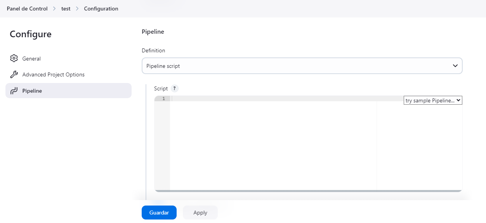

# Proyecto de Integración Continua con Jenkins y Docker

Este proyecto configura un entorno de integración continua utilizando Jenkins en un contenedor Docker. A continuación, se muestran los pasos necesarios para iniciar el entorno con Vagrant, obtener la clave de acceso inicial de Jenkins y acceder a la interfaz de Jenkins en el navegador.

## Requisitos

- Vagrant
- VirtualBox
- Docker y Docker Compose (Vagrant se encargará de instalar estos en la máquina virtual)

## Iniciar el Entorno

1. Clona este repositorio en tu máquina local.

    ```bash
    git clone https://github.com/juanlopnz/proyecto-final-nube.git
    cd proyecto-final-nube
    ```

2. Inicia la máquina virtual de Vagrant.

    ```bash
    vagrant up
    ```

   Este comando descargará la imagen de la máquina virtual especificada en el `Vagrantfile` y configurará Docker y Docker Compose dentro de la máquina virtual.

3. Conéctate a la máquina virtual para ejecutar los comandos de Docker:

    ```bash
    vagrant ssh server
    ```

## Obtener la Clave de Acceso para Jenkins

Una vez que Jenkins esté en ejecución, necesitarás una clave para acceder a la interfaz de administración. Para obtener esta clave, ejecuta el siguiente comando en la terminal de la máquina virtual:

    
    docker exec -it <id_del_contenedor_jenkins> cat /var/jenkins_home/secrets/initialAdminPassword

Reemplaza `<id_del_contenedor_jenkins>` con el nombre de tu contenedor de Jenkins. Para obtener el id exacto del contenedor, puedes ejecutar:

    docker ps

Este comando te dará la clave inicial de acceso para Jenkins.

## Acceder a Jenkins en el Navegador

1. Abre tu navegador y navega a la siguiente dirección:

    ```
    http://192.168.100.3:8080
    ```

   Asegúrate de que el puerto 8080 esté accesible en tu configuración de Vagrant.

2. Introduce la clave de acceso que obtuviste en el paso anterior.

3. Debes instalar los plugins por defecto, como se muestra en la siguiente imagen.


4. Puedes crear un nuevo usuario administrador o continuar con la cuenta inicial para explorar la interfaz de Jenkins y empezar a configurar tus pipelines, en este caso, se selecciona la opción de "Skip and continue as admin".


5. Por último, continúa con el paso hasta que tengas acceso a la interfaz de Jenkins.

## Desplegar y Ejecutar el Pipeline

Una vez dentro de Jenkins, puedes crear y ejecutar un pipeline para construir, probar y desplegar tu aplicación en el entorno Docker.

### Crear Trabajo

**Descripción:** Este es el panel de control de Jenkins, la página principal. Desde aquí, seleccionaremos la opción "Create a job" para comenzar a configurar un nuevo pipeline.

### Seleccionar Pipeline

**Descripción**: Esta imagen muestra la página de creación de un nuevo trabajo en Jenkins. Aquí, debes definir el nombre del trabajo y seleccionar la opción de "Pipeline" como tipo de proyecto.

### Agregar Jenkinsfile

**Descripción**: En esta imagen se visualiza la configuración del pipeline, donde puedes definir los pasos que Jenkins seguirá. Esta sección incluye opciones para usar Jenkinsfile o definir directamente los scripts de pipeline, Aqui pegaremos el script del `Jenkinsfile` presente en este repositorio del proyecto. Este archivo contiene las instrucciones y etapas del pipeline, desde la construcción hasta el despliegue.

### Iniciar Proceso

**Descripción**: La imagen refleja el momento en que se inicia la ejecución del pipeline, en la opción de "Contruir ahora". Jenkins muestra el estado actual y el progreso de cada etapa definida en el `Jenkinsfile`.

### Ver Consola

**Descripción**: Esta captura enseña la salida de la consola de Jenkins durante la ejecución del pipeline. Aquí, los usuarios pueden revisar logs, identificar errores y confirmar que los pasos se completan correctamente.

## Detener el Entorno

Para apagar la máquina virtual de Vagrant y detener todos los contenedores de Docker, ejecuta:

    vagrant halt

---

¡Listo! Ahora tienes un entorno completo de Jenkins en Docker utilizando Vagrant.
